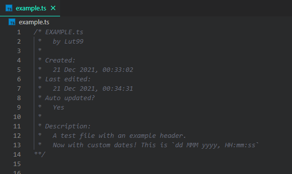

# File Header Generator

The File Header Generator extension aims to quickly generate readable headers for several programming languages. Additionally, it also automatically updates the last edited time.

## Features

The File Header Generator generates headers in one, pre-determined lay-out. This layout displays a more readable type of file name, the creator of the file, when the file was created and when the file was edited most recently. Additionally, it also shows a description (see the picture below for an example).

  
_Image using the [Panda Syntax](https://marketplace.visualstudio.com/items?itemName=tinkertrain.theme-panda) theme_

The creation of a new header is really easy. Simply run the command: "Generate Header" from the command palette, type a discription for your file and hit enter. This description can, of course, also be added later on by editing the header manually. Note that when adding the header via the input box, it is automatically hard-wrapped to a total of 79 characters per line.

When the header is generated, it is automatically maintained (i.e., the 'Last Edited' date is updated) every time the file is saved. To stop this behaviour, set 'Auto updated?' to no or remove it altogether.

## Commands

The File Header Generator extension current contributes the following two commands:

* `file-header-generator.generateHeader`: Generates a header in the current file. Once run, it first prompts the user to input a description, which will automatically be linewrapped in the resulting header. The header will be placed at the start of the file, before any text already present.

## Extension Settings

This extension contributes the following settings:

* `file-header-generator.enabled`: Enables or disables this extension.
* `file-header-generator.username`: Set your own name to sign the headers generated with this extension.
* `file-header-generator.searchLines`: Number of lines to search for the Auto Updated and Last Edited fields. More lines means more extensive search on non-updated files, but more lines allows for more complicated headers before the fields can appear.
* `file-header-generator.dateFormat`: The format of dates written by the FileHeaderGenerator. Is set to the current locale by default (see the list of special tokens below). For an overview of the tokens available, refer to [https://moment.github.io/luxon/#/formatting?id=table-of-tokens](https://moment.github.io/luxon/#/formatting?id=table-of-tokens.). Additionally, there are a few extra values:
    * `<locale>`: Formats according to the standard locale, as reported by the system. Can also use the `FFF` format for this.
    * `<iso>`: Formats according to the standard ISO format.

## Issues

If you encounter any issues, have suggestions or would like something to change, don't hesitate to leave an issue at our [github](https://github.com/Lut99/FileHeaderGenerator/issues)! Please try to use the appropriate tags so I can process them more efficiently.

Also note that I'm mostly making this extension for myself - that means that I might not respond to issues immediately or incorporate them, even if they're super good ideas.

## Release Notes

See the release notes for each version below. For a full overview, check CHANGELOG.md.

### 1.0.0

Initial release of the extension.

### 1.0.1

Added Typescript and Javascript support.

### 1.0.2

Extension was now disabled whatever the setting was. Also added notification for when Generate Header is run but the extension isn't enabled.

### 1.0.4

Added CUDA files support.

### 1.0.6

Added support for HTML, CSS and PHP languages.

### 1.0.7

Fixed a few vulnerabilities and added support for shellscript (bash etc), Makefile, Cmake and GLSL files.

### 1.1.0

Changed the date formatting from local to custom, and added support for Rust files. Also fixed the bug where the auto-update wouldn't work on Windows.
