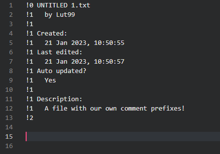
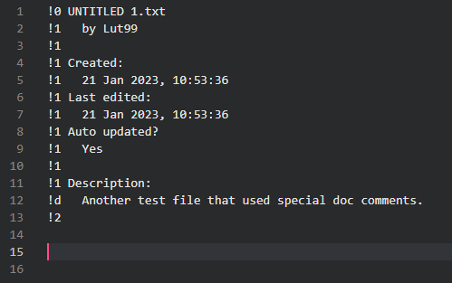
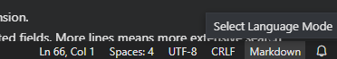
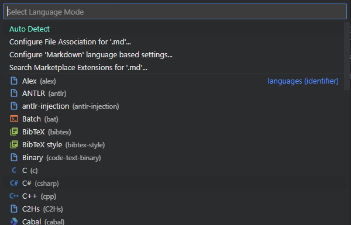

# File Header Generator

The File Header Generator extension aims to quickly generate readable headers for several programming languages. Additionally, it also automatically updates the last edited time.


## Features

The File Header Generator generates headers in one, pre-determined lay-out. This layout displays a more readable type of file name, the creator of the file, when the file was created and when the file was edited most recently. Additionally, it also shows a description (see the picture below for an example).

  
_Image using the [Panda Syntax](https://marketplace.visualstudio.com/items?itemName=tinkertrain.theme-panda) theme_

The creation of a new header is really easy. Simply run the command: "Generate Header" from the command palette, type a discription for your file and hit enter. This description can, of course, also be added later on by editing the header manually. Note that when adding the header via the input box, it is automatically hard-wrapped to a total of 79 characters per line.

When the header is generated, it is automatically maintained (i.e., the 'Last Edited' date is updated) every time the file is saved. To stop this behaviour, set 'Auto updated?' to no or remove it altogether.


### Custom languages
In addition to a wide range of builtin languages, the File Header Generator also supports defining custom languages.

A language is defined in terms of a _comment set_, which is either a triplet or quadruplet of "comments" (though they can be any string) that are written before each line of the header.

There are three comment types that must be defined for every language:
- The first comment in the set is the _start comment_, i.e., the prefix printed before the first line.
- The second comment in the set is the _middle comment_, i.e., the prefix printed for lines not covered by the other comment types.
- The third comment in the set is the _end comment_, i.e., the prefix printed for the last line.

Then there is also one optional comment type:
- The fourth comment in the set is the _doc comment_, which is printed before lines part of the description. This distinction allows some languages to extract semantic information from the header (e.g., Rust).

Concretely, you can define your own comment by adding it to the map in the `file-header-generator.customLanguages` setting. For example, you can set the following in your [`settings.json`](https://code.visualstudio.com/docs/getstarted/settings) for a Plain Text (`plaintext`) file:

```json
{
    "file-header-generator.customLanguages": {
        "plaintext": [ "!0", "!1", "!2" ],
    }
}
```
As you can see, the syntax is mapping the language ID to a list with each of the definitions for the comment types.

When you generate a header in such a file, you should get:

  
_An example header generated with our custom definition, which shows where each comment type is printed._

Another example where we use a custom docstring:
```json
{
    "file-header-generator.customLanguages": {
        "plaintext": [ "!0", "!1", "!2", "!d" ],
    }
}
```

  
_An example header generated with our custom definition that also shows a doc comment._

You can add as many custom mappings as you like.

> Tip! You can discover the language ID by opening up the language menu and checking the brackets after every language. That shows its ID.
> 
> The button can be found in the bottom-right, usually with the name of the language of your current file:
> 
>   
> 
> Clicking it reveals a menu that looks like the following:
> 
>   


## Commands

The File Header Generator extension current contributes the following command:

* `file-header-generator.generateHeader`: Generates a header in the current file. Once run, it first prompts the user to input a description, which will automatically be linewrapped in the resulting header. The header will be placed at the start of the file, before any text already present.


## Extension Settings

This extension contributes the following settings:

* `file-header-generator.enabled`: Enables or disables this extension.
* `file-header-generator.username`: Set your own name to sign the headers generated with this extension.
* `file-header-generator.searchLines`: Number of lines to search for the Auto Updated and Last Edited fields. More lines means more extensive search on non-updated files, but more lines allows for more complicated headers before the fields can appear.
* `file-header-generator.dateFormat`: The format of dates written by the FileHeaderGenerator. Is set to the current locale by default (see the list of special tokens below). For an overview of the tokens available, refer to [https://moment.github.io/luxon/#/formatting?id=table-of-tokens](https://moment.github.io/luxon/#/formatting?id=table-of-tokens.). Additionally, there are a few extra values:
    * `<locale>`: Formats according to the standard locale, as reported by the system. Can also use the `FFF` format for this.
    * `<iso>`: Formats according to the standard ISO format.
* `file-header-generator.customLanguages`: Defines support for custom languages. Map the language ID to a triplet of a start, middle and end comment, and optionally a docstring. See [its own section](#custom-langauges) for more information.
* `file-header-generator.docString`: Whether or not to use special doc-comments for the description part. For example, Rust has `//!`, which makes the language server aware of the description for the module. Note that enabling this will automatically overwrite old style comments on save (and vice versa).


## Issues

If you encounter any issues, have suggestions or would like something to change, don't hesitate to leave an issue at our [github](https://github.com/Lut99/FileHeaderGenerator/issues)! Please try to use the appropriate tags so I can process them more efficiently.

Also note that I'm mostly making this extension for myself - that means that I might not respond to issues immediately or incorporate them, even if they're super good ideas (but I am definitely willing to listen).


## Release Notes

See the release notes for each version below. For a full overview, check CHANGELOG.md.

### 1.3.0

Support for custom language definitions, as well as a few new builtin ones (WGSL and [eFLINT](https://gitlab.com/eflint)). This release also sees a security fix.

### 1.2.0

Added docstring-aware style for Rust and an appropriate setting for that. Also revamped backend parsing algorithm.

### 1.1.0

Changed the date formatting from local to custom, and added support for Rust files. Also fixed the bug where the auto-update wouldn't work on Windows.

### 1.0.7

Fixed a few vulnerabilities and added support for shellscript (bash etc), Makefile, Cmake and GLSL files.

### 1.0.6

Added support for HTML, CSS and PHP languages.

### 1.0.4

Added CUDA files support.

### 1.0.2

Extension was now disabled whatever the setting was. Also added notification for when Generate Header is run but the extension isn't enabled.

### 1.0.1

Added Typescript and Javascript support.

### 1.0.0

Initial release of the extension.
